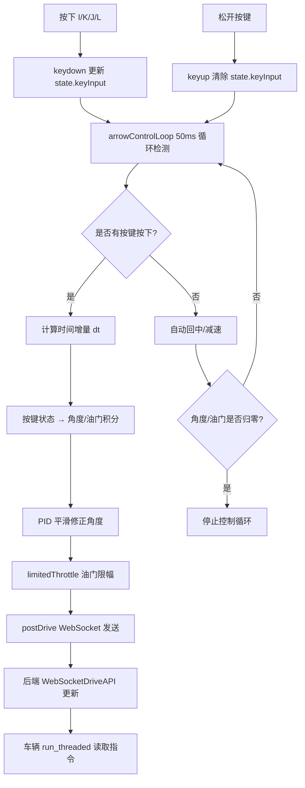

## IKJL 键盘增量控制逻辑解析（带 PID + 回中 + 自动减速）

### 1. 按键核心功能（全新实现）

**设计理念**：模拟"极品飞车"类竞速游戏的操控手感
- **I 键**：油门增加（按住持续加速，松开自动减速至 0）
- **K 键**：刹车/倒车（按住持续减速，松开自动减速至 0）
- **J 键**：向左转向（按住角度持续增加，松开自动回中）
- **L 键**：向右转向（按住角度持续增加，松开自动回中）

**与原始 IKJL 对比**：

| 特性 | 原始 IKJL（步进式） | 新 IKJL（增量式） |
|------|-------------------|-----------------|
| 控制方式 | 每次按键 ±0.05/0.1 固定步长 | 持续按住，按时间积分增量 |
| 松开行为 | 保持当前值不变 | **自动回中/减速至 0** |
| 手感 | 阶梯式、需反复按压 | **连续平滑、PID 修正** |
| 适用场景 | 精确调试、逐步微调 | **竞速驾驶、动态控制** |

### 2. 执行流程（逐步）


### 3. 关键算法详解

#### 3.1 增量控制循环（50ms 周期）

```88:181:donkeycar/parts/web_controller/templates/static/main.js
    // ---------- IKJL 增量控制循环（替代方向键）----------
    var arrowControlLoop = function() {
      setTimeout(function() {
        const dt = (now - lastTs) / 1000.0; // 时间增量（秒）
        
        // J/L 控制转向：按住时角度持续增加
        if(state.keyInput.left && !state.keyInput.right) {
          state.tele.user.angle -= state.params.steerRate * dt; // 例如 1.2 角/秒
        } else if(!state.keyInput.left && !state.keyInput.right) {
          // 松开时自动回中
          state.tele.user.angle -= sign * recenterRate * dt; // 例如 0.35 角/秒
        }
        
        // PID 平滑处理（模拟竞速游戏手感）
        pidState.error = targetAngle - pidState.output;
        pidState.integral += pidState.error * dt;
        const derivative = (pidState.error - pidState.prevError) / dt;
        const control = kp*error + ki*integral + kd*derivative;
        pidState.output = clamp(pidState.output + control, -1, 1);
        
        // I/K 控制油门：松开自动减速
        if(state.keyInput.up) {
          throttle += accelRate * dt;
        } else {
          throttle -= decelRate * dt; // 自动减速
        }
        
        postDrive(['angle','throttle']); // 发送 WebSocket
        arrowControlLoop(); // 50ms 循环
      }, 50);
    }
```

#### 3.2 PID 控制器算法

**目的**：将离散的角度指令平滑化，模拟真实车辆的转向惯性

```javascript
// PID 标准公式
output(t) = Kp × e(t) + Ki × ∫e(t)dt + Kd × de(t)/dt

// 离散化实现
pidState.error = targetAngle - pidState.output;
pidState.integral += pidState.error * dt;
derivative = (pidState.error - pidState.prevError) / dt;
control = state.params.pid.kp * pidState.error 
        + state.params.pid.ki * pidState.integral 
        + state.params.pid.kd * derivative;
pidState.output = clamp(pidState.output + control, -1, 1);
```

**参数调优指南**：

| 参数 | 默认值 | 效果 | 调大时 | 调小时 |
|------|--------|------|--------|--------|
| **Kp** | 0.8 | 比例增益，响应速度 | 响应快但易震荡 | 响应慢但稳定 |
| **Ki** | 0.0 | 积分增益，消除稳态误差 | 消除偏差但易振荡 | 可能有残余偏差 |
| **Kd** | 0.15 | 微分增益，阻尼/预测 | 抑制超调、更平滑 | 欠阻尼、易震荡 |

**典型手感预设**：
```javascript
// 街道巡航：平稳舒适
{kp: 0.6, ki: 0.0, kd: 0.2, recenterRate: 0.25, steerRate: 0.8}

// 赛道竞速：灵敏激进（默认）
{kp: 0.8, ki: 0.0, kd: 0.15, recenterRate: 0.35, steerRate: 1.2}

// 越野探险：稳健耐用
{kp: 0.5, ki: 0.05, kd: 0.25, recenterRate: 0.2, steerRate: 0.6}
```

#### 3.3 自动回中算法

松开 J/L 键后，角度以恒定速率回归到 0：

```javascript
if(!state.keyInput.left && !state.keyInput.right) {
  if(Math.abs(state.tele.user.angle) > 0.001) {
    const sign = Math.sign(state.tele.user.angle);
    const delta = state.params.recenterRate * dt; // 例如 0.35 × 0.05 = 0.0175
    const next = state.tele.user.angle - sign * delta;
    // 过零保护：避免在 0 附近震荡
    state.tele.user.angle = (sign > 0) ? Math.max(next, 0) : Math.min(next, 0);
  }
}
```

**回中速度可调**：通过页面滑块调整 `recenterRate`（0-2 角/秒）

#### 3.4 自动减速算法

松开 I/K 键后，油门以恒定速率减速至 0：

```javascript
if(!state.keyInput.up && !state.keyInput.down) {
  if(Math.abs(state.tele.user.throttle) > 0.001) {
    const signT = Math.sign(state.tele.user.throttle);
    const decel = state.params.accelRate * dt; // 使用加速率作为减速率
    const nextT = state.tele.user.throttle - signT * decel;
    state.tele.user.throttle = (signT > 0) ? Math.max(nextT, 0) : Math.min(nextT, 0);
  }
}
```

### 4. 输入与输出参数

#### 输入参数（可通过滑块调节）

| 参数 | ID | 默认值 | 范围 | 说明 |
|------|-----|--------|------|------|
| Kp | `pid_kp` | 0.8 | 0-3 | PID 比例增益 |
| Ki | `pid_ki` | 0.0 | 0-1 | PID 积分增益 |
| Kd | `pid_kd` | 0.15 | 0-2 | PID 微分增益 |
| 回中速度 | `recenter_rate` | 0.35 | 0-2 | 松开方向键后回中速率（角/秒） |
| 转向角速度 | `steer_rate` | 1.2 | 0-3 | 按住方向键时转向速率（角/秒） |
| 加速率 | `accel_rate` | 1.0 | 0-3 | 油门变化率（/秒） |
| 刹车率 | `brake_rate` | 1.2 | 0-3 | 按 K 键时减速率（/秒） |

#### 输出（WebSocket 载荷）

```json
{
  "angle": 0.352,      // -1 到 1，左负右正
  "throttle": 0.652,   // -1 到 1，前进正后退负
  "drive_mode": "user",
  "recording": false,
  "buttons": {"w1":false,"w2":false,"w3":false,"w4":false,"w5":false}
}
```

### 5. 使用场景与限制条件

#### 适用场景
- ✅ **竞速驾驶**：连续转向，松手自动回中
- ✅ **动态避障**：快速左右切换，PID 平滑过渡
- ✅ **爬坡控制**：按住 I 持续加速，松开自动减速
- ✅ **手感调优**：通过滑块实时调整 PID 参数

#### 限制与注意
- ⚠️ **需 WebSocket 连接**：断开时按键无效（控制台显示 "WS not open"）
- ⚠️ **需启动车辆**：底部按钮需显示 "Stop Vehicle"（`brakeOn=false`）
- ⚠️ **参数持久化**：存储在 `localStorage`，清除浏览器数据会重置
- ⚠️ **与摇杆冲突**：使用 IKJL 时建议不要同时操作虚拟摇杆
- ⚠️ **控制台日志**：调试时会频繁输出（50ms 一次），生产环境可注释掉

#### 调试清单
1. 打开浏览器控制台（F12）
2. 按住 I 键 → 应看到 "IKJL keys active: {up: true, ...}"
3. 观察 "IKJL sending: {angle: 0.000, throttle: 0.152}" 递增
4. 松开 I 键 → 油门自动减速至 0
5. 按住 J/L 键 → 角度持续变化，松开后自动回中
6. 若无响应，检查：
   - WebSocket 是否连接（无 "WS not open" 警告）
   - 是否点击 "Start Vehicle" 按钮
   - 参数滑块值是否正常（不为 0）

### 6. 代码位置与架构

```plaintext
donkeycar/parts/web_controller/
├── templates/
│   ├── static/
│   │   └── main.js                    # 核心逻辑
│   │       ├── 第 31-42 行：可调参数定义
│   │       ├── 第 88-181 行：IKJL 增量控制循环
│   │       ├── 第 182-187 行：PID 状态变量
│   │       ├── 第 252-287 行：IKJL 按键监听器
│   │       └── 第 360-410 行：参数滑块绑定
│   └── vehicle.html                   # UI 界面
│       └── 第 109-176 行：PID/回中/加速度调节面板
└── web.py                             # 后端 WebSocket
    └── 第 285-308 行：接收控制指令
```

### 7. 与原始 IKJL 共存

原始的步进式控制已被完全替换为增量式，若需同时支持两种模式，可：
1. 添加模式切换按钮（例如 `Shift + M`）
2. 区分短按（步进）与长按（增量）
3. 使用不同按键组（例如 WASD 步进，IKJL 增量）

