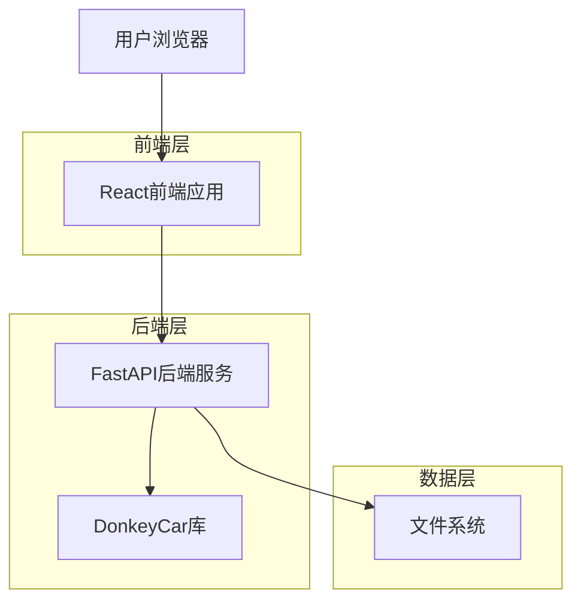
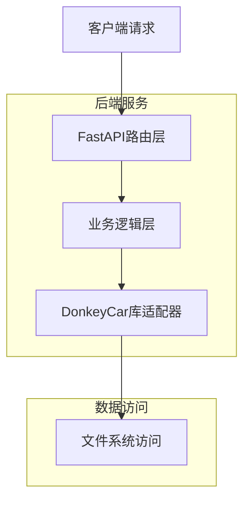
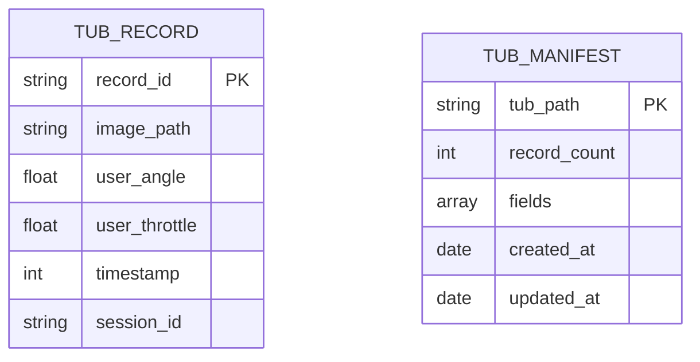

## 1. 架构设计



## 2. 技术描述

- **前端**: React@18 + Tailwind CSS@3 + Vite
- **初始化工具**: vite-init
- **后端**: FastAPI (Python)
- **核心库**: DonkeyCar Tub库、Manifest库（复用现有代码）
- **图表库**: Chart.js 或 D3.js（用于数据可视化）
- **图像处理**: Canvas API（用于图像预览）

## 3. 路由定义

| 路由 | 用途 |
|------|------|
| / | 主控制台页面，显示所有功能模块 |
| /api/config/load | POST：加载配置文件 |
| /api/tub/load | POST：加载tub数据 |
| /api/tub/records | GET：获取记录列表 |
| /api/tub/record/:id | GET：获取单条记录详情 |
| /api/tub/filter | POST：设置数据过滤器 |
| /api/tub/delete | POST：删除记录区间 |
| /api/tub/restore | POST：恢复记录 |
| /api/tub/chart | GET：获取图表数据 |

## 4. API定义

### 4.1 配置加载API

```
POST /api/config/load
```

请求参数：
| 参数名 | 参数类型 | 是否必需 | 描述 |
|--------|----------|----------|------|
| path | string | true | 配置目录路径 |

响应参数：
| 参数名 | 参数类型 | 描述 |
|--------|----------|------|
| status | boolean | 加载状态 |
| message | string | 状态信息 |
| config | object | 配置内容 |

### 4.2 数据加载API

```
POST /api/tub/load
```

请求参数：
| 参数名 | 参数类型 | 是否必需 | 描述 |
|--------|----------|----------|------|
| path | string | true | 数据目录路径 |

响应参数：
| 参数名 | 参数类型 | 描述 |
|--------|----------|------|
| status | boolean | 加载状态 |
| record_count | number | 记录总数 |
| fields | array | 数据字段列表 |

### 4.3 记录浏览API

```
GET /api/tub/records
```

查询参数：
| 参数名 | 参数类型 | 是否必需 | 描述 |
|--------|----------|----------|------|
| offset | number | false | 偏移量 |
| limit | number | false | 限制数量 |
| filter | string | false | 过滤表达式 |

响应参数：
| 参数名 | 参数类型 | 描述 |
|--------|----------|------|
| records | array | 记录列表 |
| total | number | 总记录数 |

### 4.4 图表数据API

```
GET /api/tub/chart
```

查询参数：
| 参数名 | 参数类型 | 是否必需 | 描述 |
|--------|----------|----------|------|
| fields | string | true | 字段名称（逗号分隔） |
| range | string | false | 数据范围 |

响应参数：
| 参数名 | 参数类型 | 描述 |
|--------|----------|------|
| data | array | 图表数据点 |
| labels | array | X轴标签 |

## 5. 服务器架构设计



## 6. 数据模型

### 6.1 Tub记录模型



### 6.2 前端状态模型

```typescript
interface TubRecord {
  record_id: string;
  image_path: string;
  user_angle: number;
  user_throttle: number;
  timestamp: number;
  [key: string]: any;
}

interface TubState {
  loaded: boolean;
  path: string;
  recordCount: number;
  currentRecord: TubRecord | null;
  currentIndex: number;
  filter: string;
  fields: string[];
}

interface ChartData {
  labels: string[];
  datasets: {
    label: string;
    data: number[];
    borderColor: string;
    backgroundColor: string;
  }[];
}
```

## 7. 部署架构

### 7.1 开发环境
- 前端：Vite开发服务器，端口3000
- 后端：FastAPI开发服务器，端口8000
- 支持热重载和实时调试

### 7.2 生产环境
- 前端：构建静态文件，通过Nginx或FastAPI静态文件服务
- 后端：Uvicorn + Gunicorn WSGI服务器
- 支持Windows、Linux、Mac跨平台部署
- 可通过Docker容器化部署

### 7.3 文件结构
```
donkeycar-webui/
├── frontend/          # React前端代码
│   ├── src/
│   ├── public/
│   └── package.json
├── backend/           # FastAPI后端代码
│   ├── app/
│   ├── requirements.txt
│   └── main.py
├── docs/              # 文档
└── docker-compose.yml # Docker部署配置
```