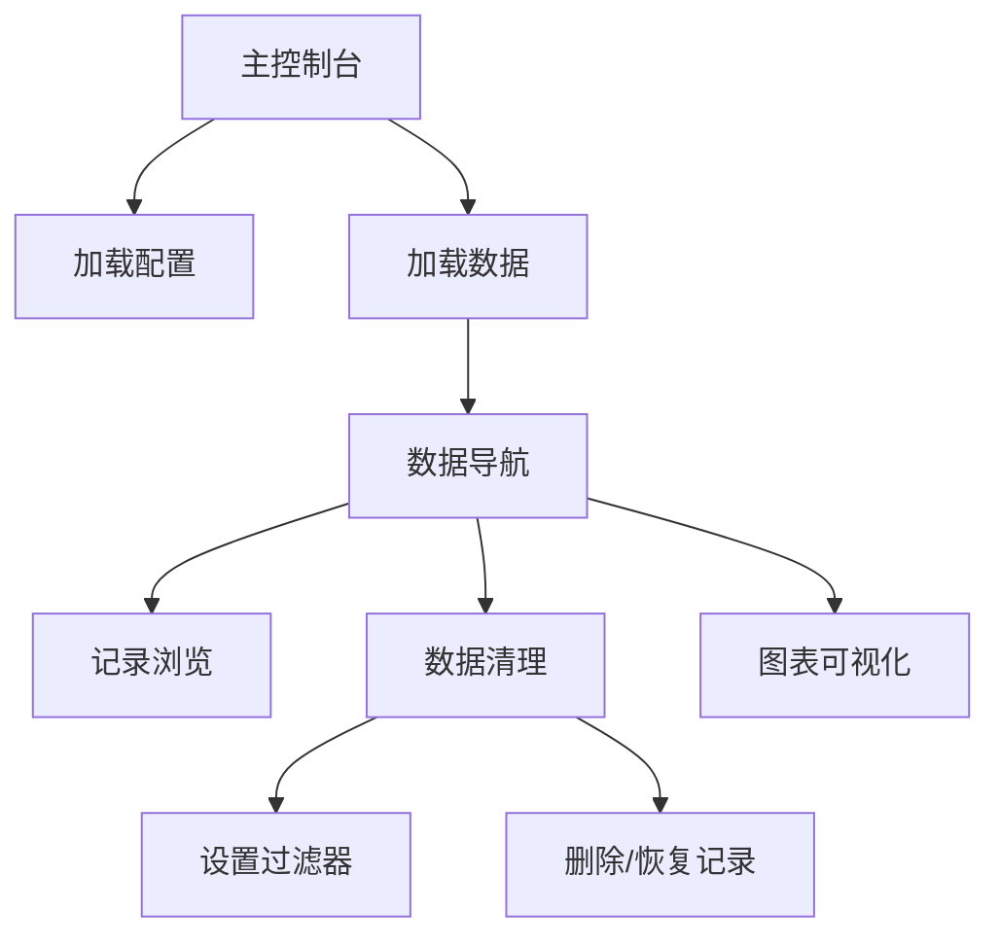

## 1. 产品概述
将Donkey Car的Kivy图形界面改写成跨平台网页版本，解决现有版本只能运行在Linux上的限制。新网页版将保持原有Tub Manager的核心功能，支持在Windows、Linux、Mac系统上通过浏览器访问，提供数据管理和可视化功能。

目标用户为Donkey Car开发者和技术爱好者，帮助他们更方便地管理训练数据、可视化传感器数据，无需依赖特定操作系统。

## 2. 核心功能

### 2.1 用户角色
| 角色 | 注册方式 | 核心权限 |
|------|----------|----------|
| 普通用户 | 无需注册 | 加载配置文件、浏览数据记录、可视化图表、数据筛选清理 |

### 2.2 功能模块
网页版Donkey Car管理器包含以下主要页面：
1. **主控制台页面**：配置加载、数据加载、数据导航、数据清理、图表可视化。

### 2.3 页面详情
| 页面名称 | 模块名称 | 功能描述 |
|----------|----------|----------|
| 主控制台 | 配置加载器 | 从车辆目录加载配置文件，支持目录选择和路径显示 |
| 主控制台 | 数据加载器 | 从车辆数据目录加载tub数据文件，显示加载路径 |
| 主控制台 | 数据导航器 | 浏览数据记录，包含图像预览、记录信息显示、播放控制按钮、滑块导航 |
| 主控制台 | 数据清理器 | 按索引区间选择记录进行删除/恢复操作，支持设置临时过滤器 |
| 主控制台 | 图表可视化 | 显示传感器数据曲线图，支持user/angle和user/throttle数据展示 |
| 主控制台 | 状态栏 | 显示当前加载的数据文件信息和记录数量 |

## 3. 核心流程

### 用户使用流程：
1. 用户打开网页，进入主控制台页面
2. 点击"加载配置"选择车辆配置目录（通常为~/mycar）
3. 点击"加载数据"选择数据目录（通常为./data）
4. 系统加载数据后，用户可以通过控制面板或滑块浏览记录
5. 用户可以设置过滤器筛选特定记录，或选择记录区间进行删除/恢复操作
6. 图表区域实时显示选中记录的传感器数据变化趋势

## 4. 用户界面设计

### 4.1 设计风格
- **主色调**：深色主题，背景使用深灰色（#1a1a1a）
- **辅助色**：青色/蓝绿色（#00bcd4）用于强调和交互元素
- **按钮样式**：圆角矩形，中等灰色背景，浅色文字
- **字体**：系统默认字体，路径显示使用等宽字体
- **布局风格**：卡片式布局，圆角面板设计
- **图标风格**：简洁线条图标，与深色主题协调

### 4.2 页面设计概述
| 页面名称 | 模块名称 | UI元素 |
|----------|----------|----------|
| 主控制台 | 配置加载器 | 深色圆角面板，白色标题，灰色副标题，圆角按钮，路径显示区域 |
| 主控制台 | 数据加载器 | 与配置加载器相同的设计风格，保持视觉一致性 |
| 主控制台 | 数据导航器 | 大面板布局，左侧图像预览区，右侧控制按钮组，底部滑块使用青色滑块按钮 |
| 主控制台 | 数据清理器 | 紧凑布局，包含区间设置按钮、删除恢复按钮、过滤器输入框 |
| 主控制台 | 图表可视化 | 深色绘图区域，白色坐标轴，右上角图例，底部操作按钮 |
| 主控制台 | 状态栏 | 底部深色横条，显示加载状态和记录数量 |

### 4.3 响应式设计
采用桌面优先设计策略，主要面向桌面端用户：
- 主布局使用多列网格系统
- 最小支持1280px宽度
- 面板在不同屏幕尺寸下保持可读性
- 移动端适配为单列布局，但主要优化桌面体验

### 4.4 交互设计
- 按钮悬停效果：轻微亮度变化
- 滑块拖拽：平滑过渡动画
- 图像加载：渐进式显示
- 数据操作：确认对话框防止误操作